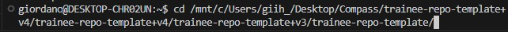
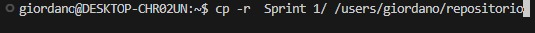
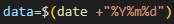
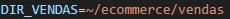
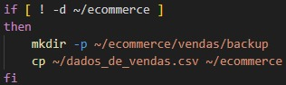
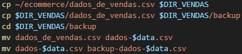
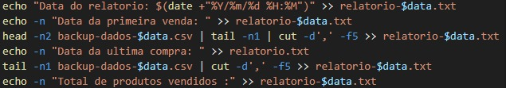
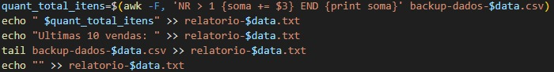
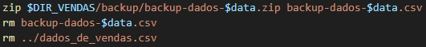
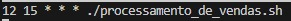

# Desafio

## Referências

1. [Scripts](./Scripts/)
2. [Dados de Vendas](./Dados_de_Vendas/)
3. [Relatórios](./Relatorios/)
4. [Backups](./Backups/)

### Passo a passo

Para realização do script:

 1. Baixe o arquivo "dados_de_vendas.csv", "processamento_de_vendas.sh" e "consolidador_de_processamento_de_vendas.sh" para a home do usuário.
 2. Baixe o script na pasta home do usuário.
 3. Dê permissão para o script executar, utilize o comando 

``` bash
       "chmod u+x ~/processamento_de_vendas.sh"
 ```

 4. Execute o script "processamento_de_vendas.csv"
 5. Execute o script "consolidador_de_processamento_de_vendas.sh

### Começando

Para realizar o desafio, utilizei o Ubuntu 24.04 em WSL, como recomendado, além do Visual Studio para vincular o GitHub com os repositórios locais.

Primeiro passo do desafio por passar os arquivos que estavam no ambiente windows, para o ambiente linux, para isso, utilizei o comando para "cd" navegar entre as pastas do windows

 e "cp" para fazer a cópia para o linux.


### Script

Depois fui fazer o script pedido. Preferi usar o Nano pela praticidade e interface mais intuitiva.
Criei apenas duas variáveis, uma para a data do sistema em formato YYYYMMDD e uma para o diretório "ecommerce/vendas".
 

Comecei testando a condição de ter o diretório ecommerce na home do usuário, se não houver, o próprio script cria a pasta e já copia o arquivo csv para o diretório.


Depois, com o comando "cp" e "mv" fui copiando e renomeando o arquivo .csv para criar o backup.


Após isso, escrevi comandos para realização do relatório pedido, utilizei "echo" e o parâmetro ">>" para a saída dos comandos serem impressas no arquivo "relatorio-data.txt".

Para obter a data da primeira venda, utilizei uma combinação de "head -n2" e "tail -n1", já que a primeira linha do arquivo .csv são as categorias. Além disso, utilizei o comando "cut -d',' -f5" para pegar apenas o último campo do arquivo.
Para obter a data da última venda, utilizei "tail -n1" e "cut -d',' -f5.


O maior desafio para mim foi pegar a soma dos itens vendidos, não tinha conseguido encontrar uma solução dentro dos cursos feitos. Porém com a ajuda de colegas de squad e de fontes da internet, encontrei o comando "awk" para obter a informação necessária.

Usei o parâmetro "-F," para delimitar os campos por ','. 'NR>1' para aplicar os parâmetros da segunda linha para frente. '{soma += $3}' para utilizar o terceiro campo e acumular o valor em 'soma". E por fim 'END {print soma}' para imprimir o valor de 'soma' na variável.


Por fim, 'zip' para compactar o backup e 'rm' para excluir os arquivos das pastas.


### Agendando e rodando o script

Para poder executar o script, é necessário dar permissão para tal, para isso, utilizei "chmod u+x ~/processamento_de_vendas".

Por fim, agendei a execução do script usando o cron. Para isso, acessei o cron pelo comando "crontab -e" e marquei a execução do script, para executar todos os dias as 15:12.

