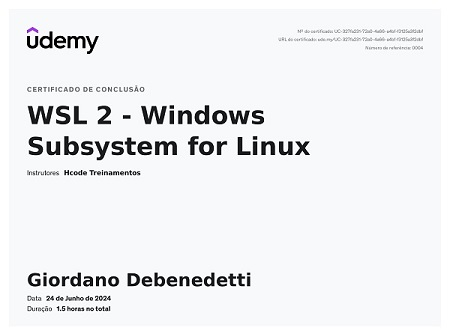

# Sprint 1

## Desafio

[Desafio](Desafio/README.md) <- Link para o Readme do Desafio

## Aprendizados

Essa primeira sprint já foi bem desafiante para mim, como não tinha experiência com Linux ou Git, tudo é novo para mim.
Porém os conteúdos dos cursos foram muito úteis, consegui entender bem as funcionalidades do Linux e Git e como eles são essenciais para o trabalho do dev.
Para fazer o script, fiz um curso paralelo ao cursos propostos na trilha.
Não tive muitas dificuldades na produção do script, exceto na parte do desafio que pede para contabilizar o total de itens vendidos, não estava conseguindo a solução com os cursos que fiz, tive que procurar por outras soluções na internet, encontrei a solução usando a ferramenta "awk".
Não tive problemas para subir o repositório para o GitHub.
Fiquei muito surpreso com a facilidade de escrever com MarkDown, é bem simples e gratificante.

Optei por usar o WSL, sabendo que é recomendação do curso. Fiz um mini-curso para instalar ele.

