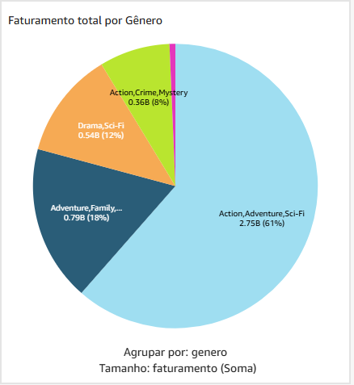
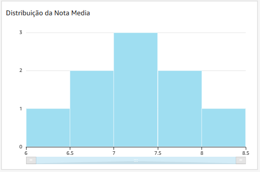

# Desafio Sprint 10

O último desafio é criar um dashboard com os dados oriundos das sprints passadas.

O tema da minha análise é a carreira de diretor do Steven Spielberg nos filmes de ficção científica.

A minha análise é descritiva e abordará temas financeiros, recepção de público e popularidade.

Eu optei por fazer o dashboard em uma página apenas, mas estrututei em 4 "partes".

[Link para o Dashboard](https://us-east-1.quicksight.aws.amazon.com/sn/accounts/009160028513/dashboards/f6953567-914d-4fbd-85ee-13b39dde01b6?directory_alias=giordanodebenedepb)

## Introdução

A primeira parte do meu dashboard trata dos dados gerais da carreira do diretor em filmes de ficção científica.

A minha ideia era dar um contexto geral e ir detalhando com outros gráficos mais profundos.

A tabela indica quais são os filmes que ele produziu e contextualiza o ano de lançamento do filme.

O gráfico em barras mostra quantos filmes o diretor produziu por décadas.

O gráfico em pizza indica os subgêneros em que o diretor trabalhou.

Logo abaixo eu mostro alguns indicadores gerais como: Faturamento total dos filmes em dólar; Nota média do filmes, considerando as médias das notas do IMDB e TMDB; a popularidade média do TMDB; e o ROI médio dos filmes, ou seja, qual o retorno médio por dólar investido.

## Financeiro

A segunda seção do dashboard trata de alguns dados financeiros.

Primeiro eu contextualizo os dados financeiros dos filmes dirigidos por ele.

Crio um gráfico com combinações entre barras e linhas para mostrar dados de orçamento, faturamento e lucro.

A próxima visualização mostra quantos porcento cada filme lucrou.

O último gráfico da seção é um gráfico de pizza que soma o total de faturamento de cada subgênero.

## Recepção do público

A próxima parte do dashboard trata de dados de recepção do público, como nota média dos filmes do diretor.

Primeiro eu exploro as notas médias por filme

Depois eu crio um gráfico de barras com as faixas das notas dos filmes.

Por último eu analíso qual foi a nota média por subgêneros.

## Popularidade

Por último, analiso a popularidade dos filmes do Steven Spielberg. Esse dado é proveniente do TMDB e mede, de 0 a 100, o quão popular um filme é no momento.

O primeiro gráfico indica a popularidade de cada filme.

Depois eu procuro alguma relação entre a popularidade de um filme e a sua nota média.

Concluo que não parece ter muita relação.

Depois eu descrevo a popularidade dos subgêneros

Agora eu procuro uma relação entre a popularidade do filme e a década de lançamento do mesmo.

E por último eu descrevo as relações entre o total de votos que um filme recebeu nas plataformas do IMDB e do TMDB, popularidade e indico o faturamento do filme.

## Conclusão

No final das contas eu imaginei um dashboard diferente dos propostos nas sprints anteriores. Não consegui muitos dados e optei por não fazer as comparações com outros diretores como gostaria de fazer.

Procurei algumas relações entre os dados, como: Nota média e orçamento, popularidade e faturamento, mas por conta do baixo número de dados, não consegui obter muitos insights. 

Eu consegui encontrar alguma relação entre o ano do lançamento de um filme e a sua popularidade. O faturamento e número de votos parece ter um peso importante para a popularidade de um filme também.
