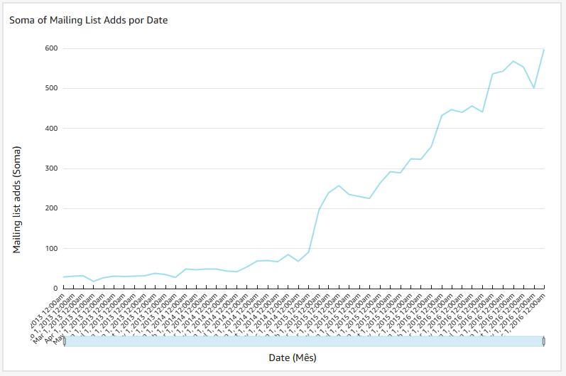

# Lab Quick Sight

A última sprint tem um laboratório de Quick Sight, para treinarmos o uso da ferramenta que será utilizada para analisar os dados refinados na sprint passada.

O primeiro passo do exercício é carregar um arquivo *csv* para o Quick Sight.

Depois de carregar o arquivo, devemos criar um gráfico, se baseando nos dados de *data*, mais especificamente, mês, e dados de *mailling list adds*, que seriam dados de pessoas que adicionaram o seu email na lista de emais diários.

O resultado do gráfico foi esse:

