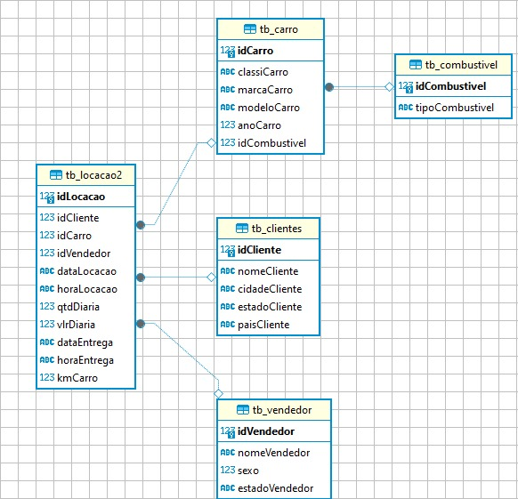
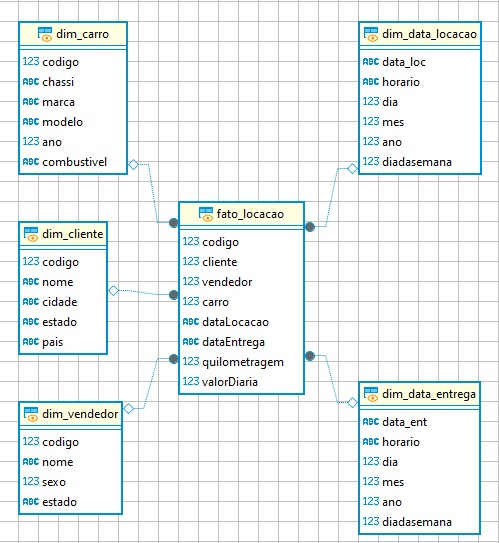

# Desafio

## Normalização e Modelo Relacional

[Script usado para normalizar o banco de dados](etapa_1/Normalizando.sql)

Apliquei as 3 primeiras formas normais para obter o modelo relacional do banco de dados.
Primeiro verifiquei a existência de dados compostos ou multivalorados no atributos.
Depois disso, com 2FN, comecei a separar as entidades e atributos, de acordo com suas relações.
Após aplicar a 2FN, verifiquei a possibilidade de existir dependências transitivas dentro das entidades, assim criei outras tabela.

Assim ficou o diagrama do modelo relacional:

### Modelo Dimensional

[Script usado para normalizar o banco de dados](etapa_2/Dimensionando.sql)

Por fim, o desafio pede que transformemos de modelo relacional para dimensional.
Seguindo os meus entendimentos do vídeo explicativo, cheguei em um fato e 5 dimensões para ele.
Fiz algumas alterações na relações, como a exclusão da *tb_combustiveis*, transferindo a coluna *tipoCombustivel* para a *dim_carros*.
Também criei duas dimesões para as datas, uma para a locação e outra para a entrega do carro.
Além disso, retirei a coluna *qtdDiaria*, pois acredito que seja fácilmente calculada via query, sem necessidade de guarda-la no modelo dimensional.

