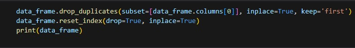
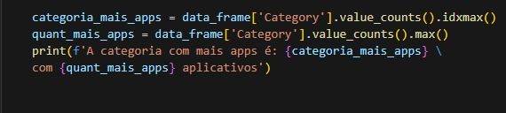
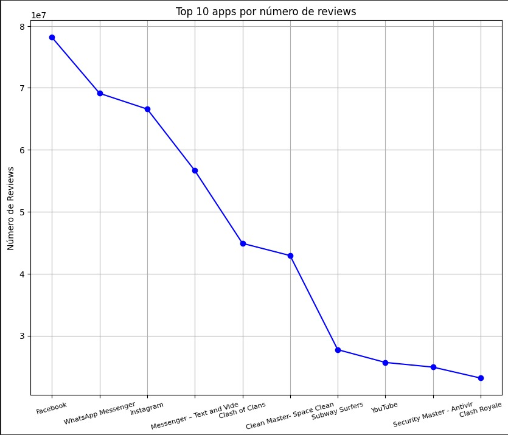

# Desafio

[Arquivo .ipynb do desafio](Desafio.ipynb)

## Etapa 1 - Preparando o Ambiente

Para o ambiente, importei a biblioteca Pandas e Matplotlib, conforme pedido nas instruções.

Também mudei algumas configurações do Pandas para poder visualizar melhor a base de dados.

## Etapa 2 - Lendo arquivo .csv e removendo as linhas duplicadas

Passei o data frame para uma variável e removi as linhas duplicadas.

Depois verifiquei outras possíveis anomalias e corrigi elas.

Percebi que existiam apps com o mesmo nome e decidi removê-los.

Procurei por outras anomalias.

Percebi algumas e corrigi.

## Etapa 3 - Criando um gráfico de barras para os top 5 apps por instalação

Para essa etapa, precisei formatar a coluna "Installs" do meu data frame.

Depois passei para a construção do gráfico de barras.

O gráfico ficou assim:

## Etapa 4 - Criando um pie chart para as categorias

Verifiquei a existência de anomilias na coluna "Installs

Depois de garantir que não existia nenhuma categoria duplicada, construí o pie chart.
Optei por juntar todas as categorias que tivessem menos que 3% dos apps. Essas categorias coloquei em uma tabela lateral auxiliar.

O resultado ficou assim:

## Etapa 5 - Mostrar o app mais caro no dataset

Tive que formatar a coluna "Price". Após a formatação, escrevi o código para obter o aplicativo mais caro do dataset:

O resultado foi esse:

## Etapa 6 - Mostrar quantos apps tem o Rating "Mature 17+"

Primeira etapa foi formatar a coluna. Após a formatação, foi hora de obter o dado da quantidade de apps com Rating "Mature 17+"

O resultado foi esse:

## Etapa 7 - Mostre top 10 apps por número de reviews

Primeiro passo foi formatar a coluna "Reviews" para o tipo inteiro

Depois, fiz a lista dos top 10 apps por número de reviews

O resultado foi esse:

## Etapa 8 - Criar dois cálculos, um em forma de lista e outro em valor

Para o cálculo em forma de lista, escolhi cálcular os top 10 aplicativos pagos com maior receita estimada, levando em consideração o número de reviews e o preço.

O resultado foi esse:

Depois, para cálculo de valor, escolhi mostrar a categoria com o maior número de apps

Esse foi o resultado:

## Etapa 9 - Criar dois gráficos para cálculos anteriores

Optei pelo gráfico de linhas para representar os apps com maior número de reviews

O gráfico ficou assim:

Por último, escolhi um gráfico de barras horizontais para representar os top 10 apps por receita estimada

O gráfico ficou assim:

