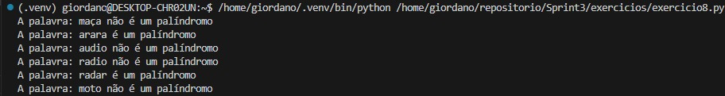

# SPRINT 2

Primeiro contato com Python e suas bibliotecas. Embora não tenha tido muita dificuldade com o conteúdo proposto no curso de Python, tive alguns problemas com gerenciamento de tempo, visto a longa duração do curso somada com a minha inexperiência com o conteúdo do mesmo. Entretanto, acredito ter conseguido cumprir com as expectativas, tanto nos exercícios, quanto no desafio final da sprint.

Durante o curso, aprendi a sintaxe básica de python, declaração de variáveis, desvios condicionais, loops, etc..
Conforme fui avançando no conteúdo, aprendi conceitos importantes de POO, métodos, funções específicas do Python, manipulação de arquivos, etc..
Como um todo, foi uma experiência muito positiva. Reitero que me comprometo a gerenciar melhor o meu tempo e fazer as próximas entregas no prazo estimado.

Segue abaixo os caminhos e evidências dos exercícios, Readme do desafio final de sprint e certificado de conclusão do curso AWS proposto para a sprint.

## Desafio

README para o desafio: -> [Desafio](Desafio/README.md)

## Exercícios

As respostas para os exercícios da Sprint 3 estão nesses arquivos abaixo

- [Exercício 1](exercicios/exercicio1.py)
- 

- [Exercício 2](exercicios/exercicio2.py)
- 

- [Exercício 3](exercicios/exercicio3.py)
- 

- [Exercício 4](exercicios/exercicio4.py)
- 

- [Exercício 5](exercicios/exercicio5.py)
- 

- [Exercício 6](exercicios/exercicio6.py)
- 

- [Exercício 7](exercicios/exercicio7.py)
- 

- [Exercício 8](exercicios/exercicio8.py)
- 

- [Exercício 9](exercicios/exercicio9.py)
- 

- [Exercício 10](exercicios/exercicio10.py)
- 

- [Exercício 11](exercicios/exercicio11.py)
- 

- [Exercício 12](exercicios/exercicio12.py)
- 

- [Exercício 13](exercicios/exercicio13.py)
- 

- [Exercício 14](exercicios/exercicio14.py)
- 

- [Exercício 15](exercicios/exercicio15.py)
- 

- [Exercício 16](exercicios/exercicio16.py)
- 

- [Exercício 17](exercicios/exercicio17.py)
- 

- [Exercício 18](exercicios/exercicio18.py)
- 

- [Exercício 19](exercicios/exercicio19.py)
- 

- [Exercício 20](exercicios/exercicio20.py)
- 

- [Exercício 21](exercicios/exercicio21.py)
- 

- [Exercício 22](exercicios/exercicio22.py)
- 

- [Exercício 23](exercicios/exercicio23.py)
- 

- [Exercício 24](exercicios/exercicio24.py)
- 

- [Exercício 25](exercicios/exercicio25.py)
- 

- [Exercicio Ator Etapa 1](exercicio/exercicio_actor.py)
- [Exercicio Ator Etapa 1 Resultado](evidencias/etapa_1.txt)

- [Exercicio Ator Etapa 2](exercicio/exercicio_actor2.py)
- [Exercicio Ator Etapa 2 Resultado](evidencias/etapa_2.txt)

- [Exercicio Ator Etapa 3](exercicio/exercicio_actor3.py)
- [Exercicio Ator Etapa 3 Resultado](evidencias/etapa_3.txt)

- [Exercicio Ator Etapa 4](exercicio/exercicio_actor4.py)
- [Exercicio Ator Etapa 4 Resultado](evidencias/etapa_4.txt)

- [Exercicio Ator Etapa 5](exercicio/exercicio_actor5.py)
- [Exercicio Ator Etapa 5 Resultado](evidencias/etapa_5.txt)

### Certificado

- Certificado do Curso AWS Partner: Economias na nuvem

