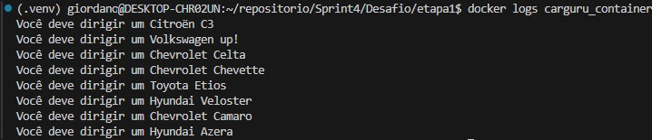
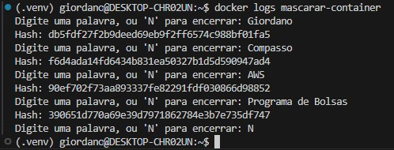

# Desafio

O desafio proposto passa por várias etapas, desde a construção do ambiente, com a instalação das dependências e configuração do sistema.

Os comandos abaixo foram utilizados para baixar o repositório do docker. Os comandos foram encontrados no site oficial do Docker:

```console
giordano@DESKTOP-CHR02UN:~$ sudo apt-get update
giordano@DESKTOP-CHR02UN:~$ sudo apt-get install ca-certificates curl
giordano@DESKTOP-CHR02UN:~$ sudo install -m 0755 -d /etc/apt/keyrings
giordano@DESKTOP-CHR02UN:~$ sudo curl -fsSL https://download.docker.com/linux/ubuntu/gpg -o /etc/apt/keyrings/docker.asc

giordano@DESKTOP-CHR02UN:~$ sudo chmod a+r /etc/apt/keyrings/docker.asc

giordano@DESKTOP-CHR02UN:~$ echo \
  "deb [arch=$(dpkg --print-architecture) signed-by=/etc/apt/keyrings/docker.asc] https://download.docker.com/linux/ubuntu \
  $(. /etc/os-release && echo "$VERSION_CODENAME") stable" | \
  sudo tee /etc/apt/sources.list.d/docker.list > /dev/null
giordano@DESKTOP-CHR02UN:~$ sudo apt-get update
```

O próximo passo foi instalar a última versão do docker.

```console
giordano@DESKTOP-CHR02UN:~$  sudo apt-get install docker-ce docker-ce-cli containerd.io docker-buildx-plugin docker-compose-plugin
```

## Etapa 1

- [Dockerfile para a etapa 1](etapa1/Dockerfile)

O primeiro passo foi contruir o arquivo Dockerfile, criei ele no mesmo diretório de onde estava no carguru.py. Optei por não abrir a imagem em alguma porta específica, já que preferi visualizar os dados criados localmente.

Para construção da imagem, utilizei o comando:

```console
giordano@DESKTOP-CHR02UN:~/repositorio/Sprint4/Desafio/etapa1$ sudo docker build -t carguru-imagem .
```

Para rodar o container:

```console
giordano@DESKTOP-CHR02UN:~/repositorio/Sprint4/Desafio/etapa1$ sudo docker run --name carguru_container carguru-imagem
```

Depois de rodar o container algumas vezes, usando *docker start*, usei o comando *docker logs carguru_container* para verificar os dados do container.

Segue abaixo o resultado dos logs do container:


Por fim removi o container e a imagem do meu sistema para liberar espaço no armazenamento.

```console
giordano@DESKTOP-CHR02UN:~/repositorio/Sprint4/Desafio/etapa1$ sudo docker rm carguru_container
giordano@DESKTOP-CHR02UN:~/repositorio/Sprint4/Desafio/etapa1$ sudo docker rmi carguru-imagem
```

## Etapa 2

- [Markdown com a resposta da pergunta](etapa2/Resposta.md)

A etapa dois faz uma pergunta em relação a possibilidade de reutilização de containers.

Apresentei os comandos necessários para reutilização do container executado na etapa 1 e expliquei que dependendo do contexto, pode ser uma má prática utilizar o mesmo container.

## Etapa 3

- [Script python para mascarar dados](etapa3/etapa3.py)
- [Dockerfile para a etapa3](etapa3/Dockerfile)

A etapa 3 pede que criemos um script em python para mascarar strings inseridas pelo usuário. Utilizei a biblioteca hashlib para criptografar as strings e imprimir o hash.

O Dockerfile dessa etapa ficou quase identico ao dá primeira etapa.
Para criar a imagem utilizei:

```console
giordano@DESKTOP-CHR02UN:~/repositorio/Sprint4/Desafio/etapa3$ sudo docker build -t mascarar-dados .
```

Para rodar o container, utilizei:

```console
giordano@DESKTOP-CHR02UN:~$ docker run -it --name mascarar-container mascarar-dados
```

Verifiquei os logs usando *docker logs mascarar-container*


