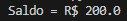

# SPRINT 4

Comecei pelo curso de Programação Funcional para Python. Compreendi os benefícios da programação funcional, como ela promove um código mais limpo, reduz possibilidades de bugs e facilita a depuração do mesmo.
Depois comecei os exercícios de python e fiz o curso de docker. No curso de docker compreendi como os containers oferecem um ambiente isolado para execução de aplicativos, garantindo que o código funcione em diferentes sistemas, reduzindo o tempo de configuração e facilitando a implantação contínua.
Para finalizar, completei os cursos da AWS Skill Builder.

## Desafio

README para o desafio: -> [Desafio](Desafio/README.md)

## Exercícios

As respostas para os exercícios da Sprint 4 estão nesses arquivos abaixo

- [Exercicio1](exercicios/exercicio1.py)

- [Exercicio2](exercicios/exercicio2.py)

- [Exercicio3](exercicios/exercicio3.py)

- [Exercicio4](exercicios/exercicio4.py)

- [Exercicio5](exercicios/exercicio5.py)

- [Exercicio6](exercicios/exercicio6.py)

- [Exercicio7](exercicios/exercicio7.py)

### Certificado

- Certificado do Curso AWS Partner: Technical Essencials

- Certificado do Curso AWS Partner: Technical Accreditation

