# Desafio

O desafio proposto pede para escolher um arquivo CSV ou JSON da base de dados do governo federal para subi-lo em um bucket no S3 e fazer consultas usando o S3 Select pelo console ou pelo Boto3.

## Escolhendo a base de dados

Visto que o desafio final tem alguma relação com cinema, escolhi uma base de dados da ANCINE, Agência Nacional do Cinema, com dados de bilheteria de todos os filmes lançados no cinema entre 01/01/2009 até 18/07/2025.

- [Arquivo CSV](lancamentos-comerciais-por-distribuidoras.csv)

Antes de tratar os dados, fiz uma breve análise no bloco de notas do windows, para aprender mais sobre a formatação da base de dados e possíveis oportunidades de tratamento.
Percebi que poderia ter problemas com a formatação da coluna *"RENDA_TOTAL"* e da coluna *"DATA_LANCAMENTO_OBRA"*
Além disso, percebi a presença de filmes com nomes duplicados.

## Formatando os dados

Sabendo dessas oportunidades, fiz um script em Python usando o Pandas para tratar e formatar alguns dados.

- [Script Para tratamento de dados](tratar_dados.py)

### Formatando os dados das colunas *RENDA_TOTAL* e *DATA_LANCAMENTO_OBRA*

Primeira parte foi formatar as colunas citadas acima:

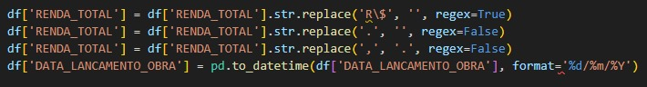

### Tirando os filmes duplicados

Percebi que existiam filmes que tinham o mesmo nome, mas eram de categorias ou paises diferentes, então estou filtrando por nome igual, país igual e mesmo tipo de obra.

O *"CPB_ROE"* que eu julguei ser um código único para cada obra, na realidade é um código que leva em consideração o nome do filme e a data de distribuição do mesmo, então não poderia usar-lo como base para tirar as duplicadas.

Como não iria trabalhar com as distribuidoras dos filmes, decidi então utilizar a primeira distribuidora do filme duplicado que aparece na lista.

Também decidi somar as suas os dados de receita bruta e bilhetes vendidos dos filmes duplicados

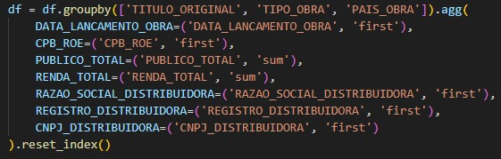

### Reorganizando a base de dados e salvando o arquivo

O meu *group by* acabou desorganizando a minha base de dados, escrevi o código abaixo para reorganziar:

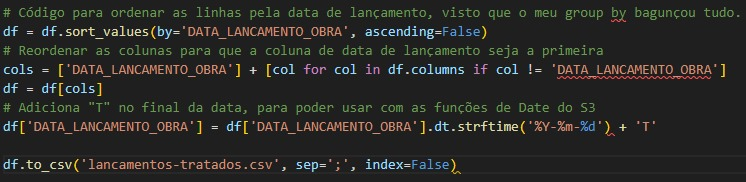

Depois de reorganizado, salvei a db formatada em outro arquivo:


- [Arquivo CSV com os dados formatados](lancamentos-tratados.csv)

## Configurando o ambiente e configurando AWS CLI

Antes de começar o script para criar os bucket, tive que configurar o meu ambiente e as credenciais da aws.

Instalei o boto3 e suas dependências

```console
pip install boto3[crt]
```

Depois instalei o AWS CLI

```console
$ curl "https://awscli.amazonaws.com/awscli-exe-linux-x86_64.zip" -o "awscliv2.zip"
unzip awscliv2.zip
sudo ./aws/install
```

Por fim, configurei as credenciais da AWS.
Tentei configurar usando *aws configure* porém tive problemas depois.

Para resolver, usei *nano ./.aws/credentials* para inserir manualmente as minhas credenciais.

## Fazendo o script

[Script S3](s3.py)

Com o ambiente configurado e a credenciais corretamente configuradas, comecei a trabalhar no script para subir o meu arquivo já tratado para um bucket criado pelo próprio script, e depois de tudo isso, fazer uma consulta no arquivo.

Primeiro passo foi importar a bibliotecas que seriam utilizadas no script

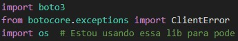

A biblioteca **os** eu usei apenas para poder referenciar a pasta do usário usando o '~'

Depois eu criei as variáveis que utilizei nas funções criadas:

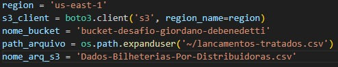

***s3_client*** é o tipo de serviço que vou usar
***region*** é a região que vou usar, sei que a região padrão é o *us-east-1*, mas optei por colocar mesmo assim, por prática.
***nome_bucket*** é o nome do meu bucket.
***path_arquivo*** é o caminho do arquivo que vou subir para o s3.
***nome_arq_s3*** é o nome do arquivo dentro do bucket.

### Call para as funções

Para chamar as funções, escrevi assim:

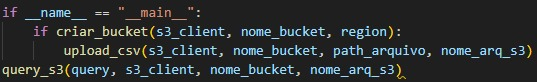

Para esse script eu desenvolvi 3 funções:

### Função para criar o bucket

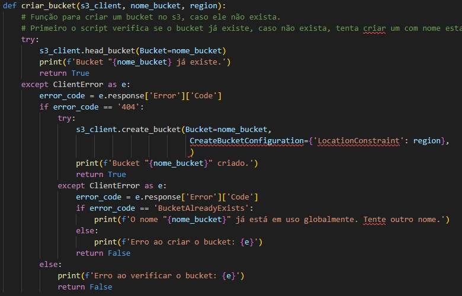

A minha ideia principal desse script era primeiro verificar se o bucket já tinha sido criado na minha conta, caso positivo, retornava *True*. Em caso negativo, tentava criar o bucket com o nome selecionado. Se ele conseguisse criar, ele retornava *True*. Caso negativo, retornava qual tinha sido o motivo da falha.

### Função para subir o arquivo para o bucket

Agora com o bucket criado, posso subir o arquivo tratado para o bucket.

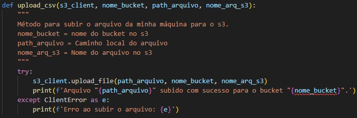

Muito parecido com a função anterior: tenta subir o arquivo e retorna *True*, em caso de erro, printa o erro na tela.
**Eu não fiz um teste no início para verificar a existência do arquivo no bucket, pois tive vários problemas com a minha query, e para não ter que deletar o arquivo toda a hora que fosse mudar algo na query, decidi tirar a conferência no início e apenas sobreescrever o arquivo**

#### Evidências da criação do bucket e do upload do arquivo

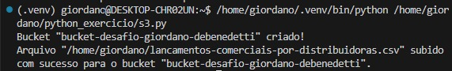


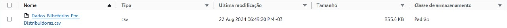

### Função para consulta

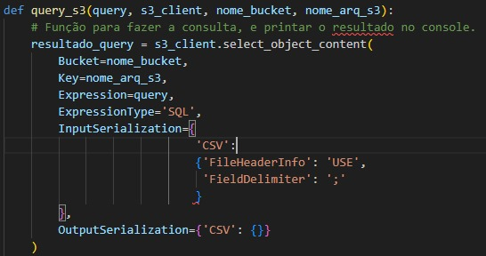

Para a consulta, utilizei a função .select_from_object. Como os dados eram separados por ';', utilizei o arg *FieldDelimeter* para especificar o ';' como separador.

A minha query foi essa abaixo:

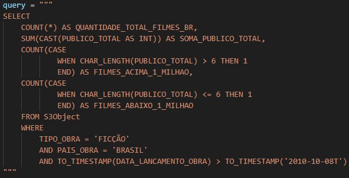

O desafio pedia que usássemos algumas funções específicas e que sugeria fazer tudo em uma consulta.

**WHERE** Usa dois operadores lógicos - Para escolher apenas o filmes brasileiros de ficção
**SUM** E **COUNT** Duas funções de agregação - Para calcular o total de filmes que venderam mais que um milhão e menos de um milhão de bilhetes, assim como o total deles
**CASE** como função condicional - Para separar em duas tabelas diferentes os filmes acima
**CAST** como função de conversão - Para converter a coluna *PUBLICO_TOTAL* para inteiro
**CHAR_LENGHT** como função de string - Para caso a linha tenha mais de 6 chars, ela vendeu mais que um milhão.
**TO_TIMESTAMP** como função de data - Para converter a coluna *DATA_LANCAMENTO_OBRA* e selecionar apenas os filmes que foram lançados depois da data estabelecida

A minha ideia era buscar a quantidade total de filmes de ficção brasileiros que foram feitos após 08/10/2010 e contar quantos filmes tiveram mais de um milhão de bilhetes vendidos e quantos tiveram menos de um milhão.

Como último passo, printei na tela. Não consegui imprimir com os nomes das colunas que criei, então coloquei elas em uma variável separada.

O código do print ficou assim:

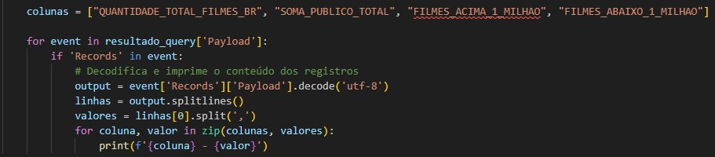

E o resultado final foi esse:

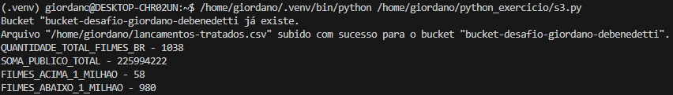
