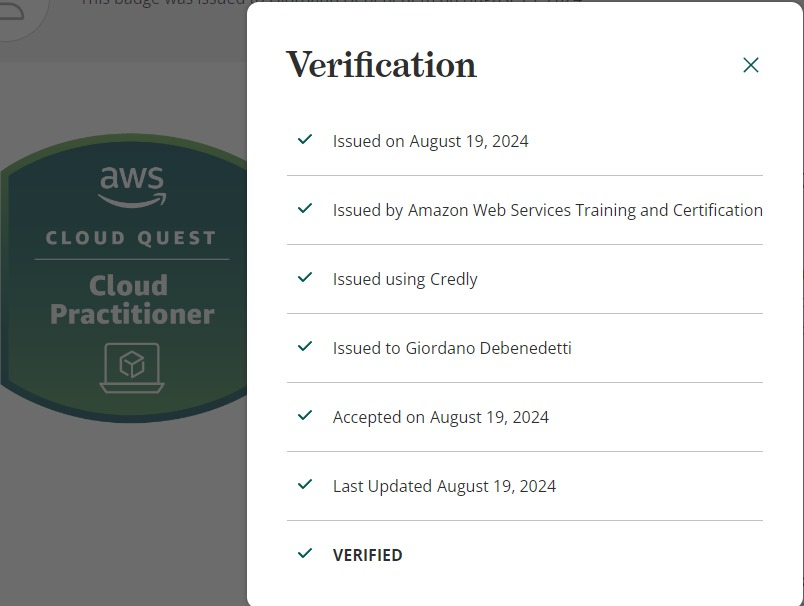
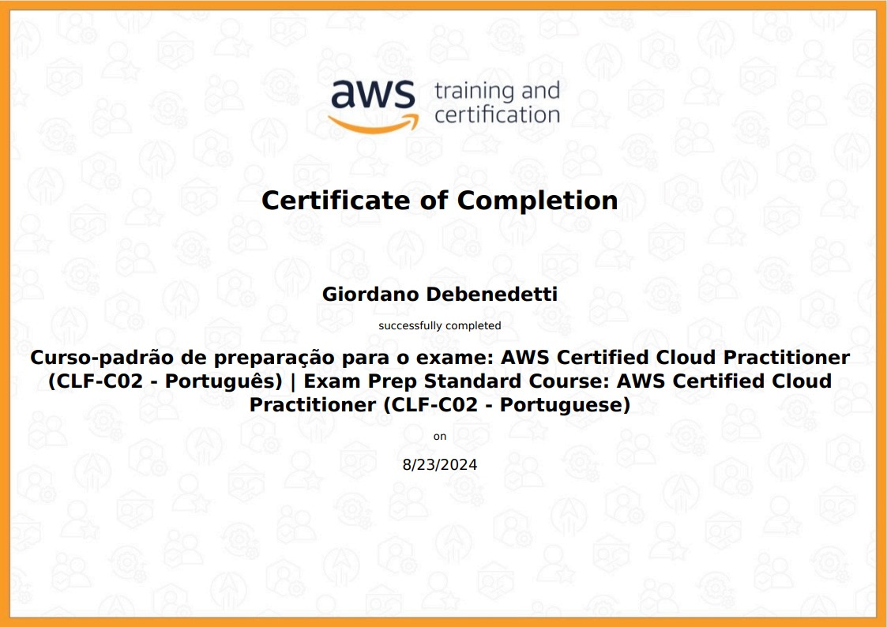

# SPRINT 5

Na sprint 5, eu comecei com o jogo da AWS, o Cloud Quest. Lá aprendi de uma maneira mais prática a começar instâncias com o EC2, criar e gerenciar VPCs e grupos de Segurança, utilizar o DynamoDB e o Amazon EBS,e fazer previsões e orçamentos usando a calculadora da AWS. Também aprendi a monitorar e escalar horizontalmente e verticalmente instâncias usando o Auto Scalling e o Health Check.

Depois de ter terminado o Cloud Quest, comecei a trabalhar com o desafio.

Após o término do desafio, concluí o curso de preparação da prova da AWS. Onde compreendi melhor o formato da prova, o conteúdo que vai ser cobrado e as suas regras.

Como tive mais tempo, aproveitei para finalizar alguns dos cursos opicionais que ficaram pendendes. Como o de Scrum e Segurança.

## Desafio

README para o desafio: -> [Desafio](Desafio/README.md)

### Certificado

- Certificado do Curso AWS Partner: Cloud Quest

- Certificado do Curso AWS Partner: Curso Padrão de Preparação para o exame

