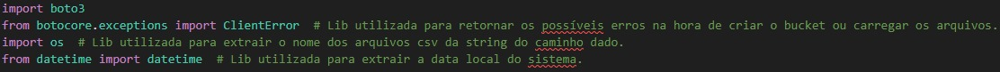

# Desafio

O desafio proposto é fazer um script que crie um bucket no S3 e carregue dois arquivos CSV para o mesmo. Depois de criar esse script, devemos configurar um container para rodar o script.
Além dessa parte prática do desafio, decidi a minha análise para o desafio final: a análise feita será referente aos trabalhos de Steven Spielberg no gênero Sci-fi, se os filmes que ele digiriu nesse gênero foram melhores recebidos pelo público comparado a outros gêneros.

## Criando o script em python

A primeira parte do desafio é criar o script em python usando a biblioteca boto3 para criar um bucket no s3 e carregar os dois arquivos CSV para caminhos específicos dentro do bucket.

- [Script Python](script.py) <- Link para o Script 

### Importanto as bibliotecas utilizadas

Primeiro passo foi importar algumas bibliotecas que seriam usadas para o script. Além do boto3, utilizei o *boto.exceptions* para me retornar possíveis erros com a criação do bucket e carregamento dos arquivos csv. A lib *os* para extrair o nome do arquivo da variável do caminho dela. E a biblioteca *datetime* para extrair a data do sistema, importante para formatar o caminho de diretórios dentro do bucket.

### Variáveis utilizadas

Depois de importar as bibliotecas, iniciei algumas variáveis que serão utilizadas no script.

Com as variáveis eu defini a região que o bucket será criado, os caminhos dos arquivos dentro do container, o nome do bucket e o caminho base para criação da cadeia de diretórios dentro do bucket.

Depois de criar as variáveis, defini como vou chamar a função para criação do bucket.

### Função para criar o bucket

A função *criar_bucket* verifica se o bucket já existe na minha conta.

Caso o bucket não exista, ele tenta criar usando os parâmetros passados. Em caso de erro, ele retorna o erro.

Caso a função a retorne verdadeiro, o programa chama a função para carregar os arquivos csv para o bucket.

### Criando as keys para 

Depois da criação do bucket, o código tenta carregar os arquivos csv. Antes de carregar, eu preciso definir o caminho dos arquivos.

O desafio pede que os arquivos sejam carregados em um caminho específico *nome_bucket/camada/origem do dado/formato do dado/especificação do dado/ano de processamento/mes/dia/arquivo*

Para isso eu criei a variável *s3_key_base* com a string *Raw/Local/CSV/*

Utilizando a biblioteca *os* eu consigo extrair o nome do arquivo do caminho dado pela variável *path_arquivo*.

Por fim, a biblioteca *datetime* extrai ano, mês e dia do sistema e já formata separado por "/" e em formato de string.

Se o arquivo for o *movies.csv* ele cria o caminho todo para movies, caso contrário, cria para séries.

### Carregando os arquivos para o S3

Depois de gerar o caminho do arquivo para o s3, a função *upload_csv* carrega os arquivos.

### Testando o script

Para testar a funcionalidade do script, alterei as variáveis *path_arquivo_movies* e *path_arquivo_series* para um caminho local da minha máquina, que continham os arquivos *.csv*.
Depois eu rodei o script.

A imagem acima mostra a criação do bucket.

## Configurando Dockerfile

Como segunda parte do desafio, fomos desafiados a criar uma imagem Docker para carregar os arquivos em um volume, para persistir os dados e rodar o script python criado anteriormente.

- [Dockerfile](Dockerfile) <- Link para o Dockerfile

Primeiramente usei a imagem base do python 3.12.
Depois defini qual seria a pasta onde os arquivos seriam carregados.
O comando *RUN* foi utilizado para instalar a biblioteca *boto3* no container.
Depois carreguei os arquivos do script e os dois csv e criei um volume.
Por fim, o comando *CMD* roda o script.

## Criando a imagem

Para criar a imagem, primeiro fui até a pasta onde estava o dockerfile.

Depois criei a imagem com *docker build*

Evidência da criação da imagem

## Rodando o container localmente

Por fim, rodei o container localmente para criar o bucket e subir os arquivos para o S3.
Para isso, utilizei *docker run* utilizando a opção *-e* para colocar como variáveis de ambiente as minhas credenciais da aws.
Os valores foram alterados no print por questões de segurança.

Evidências da criação do bucket e carregamento dos arquivos estão nas imagens abaixo:

#### Data lake

#### Movies

#### Series 

