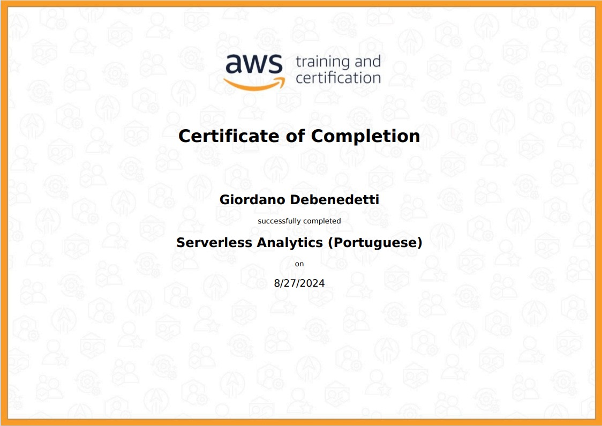
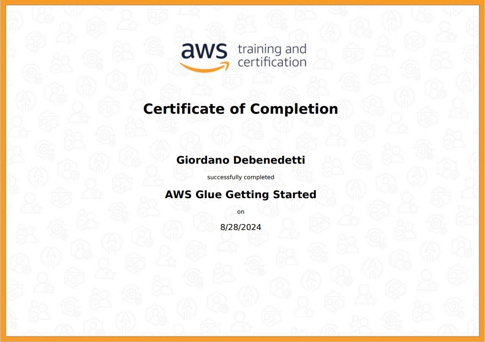

# SPRINT 6

Na sprint 6, eu comecei com os cursos da AWS, os cursos eram referentes as ferramentas Athena, Glue, RedShift, QuickSight e EMR. Além dos curso das ferramentas, fiz os cursos de Analytics e Data Warehousing.

Segui depois para os exercícios, o primeiro era para criar um bucket no S3 e fazer um upload de um arquivo CSV, depois desses passos, ativei a Hospedagem de um site estático usando o bucket criado anteriomente.
O próximo exercício pedia para fazer querys usando o AWS Athena, primeiramente atualizei o meu bucket no S3 para poder salvar as querys feitas no Athena, depois criei a tabela me baseando no CSV salvo no bucket do S3 e por último, foi feito uma query para determinar os 3 nomes mais comuns em cada década.
O último exercício era relacionado ao AWS Lambda, o exercício pedia que criássemos uma função no Lambda, após a criação da função, o exercício pedia que criássemos um layer para empacotar o Pandas e poder utiliza-lo na nossa função anteriormente criada. Para criar o layer, o exercício pedia para criar um Dockerfile que empacotasse a lib Pandas na nossa máquina local, a fim de fazer o upload da mesma para a Layer.

- [Exercícios](exercicios/README.MD) <- Passo a passo dos exercícios

## Perguntas para o Desafio Final

Por fim, comecei o desafio com da Sprint. Primeiramente, li todos os processos até a sprint final e decidi qual análise será feita.
Considerando os gêneros da minha squad, Fantasia/Sci-fi, vou fazer a seguinte análise referente aos filmes de ficção científica dirigidos por Steven Spielberg. 
Algumas das perguntas a serem respondidas são:
- **Como foi a carreira de Steven Spielberg com o gênero sci-fi? Quais foram os filmes que ele dirigiu nesse tema com melhor recepção do público? Quais foram os mais rentáveis?**

A minha ideia principal é essa, e conforme mais dados forem consumidos, posso fazer outras análises paralelas.

O desafio dessa sprint em si, pede para criar um script em python usando o Boto3 para subir os CSVs de Filmes e Séries em um bucket do S3, depois da criação do script, foi criado um Dockerfile para rodar o script localmente, depois de rodar o script localmente, verifiquei a criação do bucket no S3 e o upload dos dados no mesmo.

# Desafio

README para o desafio: -> [Desafio](Desafio/README.md)

# Certificados

- Certificado do Curso AWS Partner: Analytics Parte 1

- Certificado do Curso AWS Partner: Analytics Parte 2

- Certificado do Curso AWS Partner: Serverless Analytics

- Certificado do Curso AWS Partner: Athena

- Certificado do Curso AWS Partner: Glue

- Certificado do Curso AWS Partner: EMR

- Certificado do Curso AWS Partner: Redshift

- Certificado do Curso AWS Partner: Datawarehousing

- Certificado do Curso AWS Partner: Quicksight
