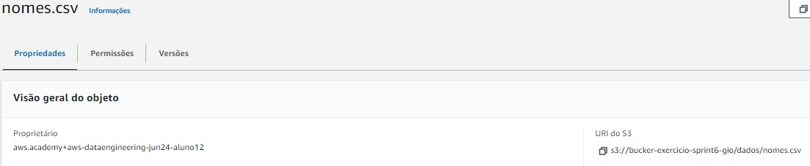

# Exercicio S3

O primeiro exercício pede para criar um bucket no S3, carregar um arquivo csv para dentro dele, configurar o bucket para hospedar um site estático e fazer algumas configurações no bucket, a fim de tornar o bucket publicamente visível. Depois disso foi feita uma configuração nos arquivos *index.html* e *error.html*, depois dessa configuração, foi feito um teste para ver se o site estava funcionando corretamente.


O CSV de dados devidamente carregado no bucket



Por fim, o site devidamente configurado.


# Exercício Athena

O exercício pedia para configurar o bucket criado anteriormente para salvar as querys feitas pelo Athena.
Depois disso, criei o banco de dados e a tabela baseada no arquivo csv que foi carregado anteriormente para o bucket.


Por último, exercício pede para fazer uma consulta no banco de dados, essa consulta deve selecionar os 3 nomes mais comuns das décadas, a partir da década de 1950.

```sql
WITH Decadas AS (
    SELECT 
        nome, 
        SUM(total) AS total_usado, 
        FLOOR(ano / 10) * 10 AS decada
    FROM 
        bancogio.pessoas
    WHERE 
        ano >= 1950
    GROUP BY 
        nome, 
        FLOOR(ano / 10) * 10
),
TopNomes AS (
    SELECT 
        nome, 
        total_usado, 
        decada,
        ROW_NUMBER() OVER (PARTITION BY decada ORDER BY total_usado DESC) AS rank
    FROM 
        Decadas
)
SELECT 
    decada, 
    nome, 
    total_usado
FROM 
    TopNomes
WHERE 
    rank <= 3
ORDER BY 
    decada, 
    total_usado DESC;
```

Para a consulta, precisei criar uma coluna auxiliar chamada décadas em uma subconsulta, para isso, precisei truncar os dados da coluna ano, fiz isso dividindo o valor por 10 e depois multiplicando por 10.

Além disso, precisei criar um "rank". Para isso usei a função *Row_Number()* para atribuir um número sequencial para cada linha. *PARTITION BY decada* separa os dados por décadas. Por fim o *ORDER BY total_usado DESC* organiza a quantidade total de nomes usados de forma descrente, fazendo com que o nome mais usado seja de rank 1, por exemplo.

No fim, escolho apenas os nomes com rank maior ou igual a 3, ordenados pela década e pelo total usado.

O resultado é esse:


# Exercício Lambda

O último exercício pedia para criar uma função no Lambda, essa função utiliza a biblioteca *Numpy* e *Pandas*. Para isso, precisamos configurar ela utilizando alguns parâmetro apresentados pelo próprio exercício.
Quando vamos executar a função, não consegui obter sucesso por conta da falta da lib *Pandas*. Para resolver esse problema, precisamos criar uma camada para empacotar a biblioteca e carrega-la para a função.
A forma de resolver isso é apresentada pelo exercício, precisamos criar um Dockerfile e passar alguns comandos e parâmetros apresentados pelo próprio exercício. 
Portanto alguns problemas surgiram com essa versão do Python e tive que mudar a versão utilizada para o Python 3.11.
Depois de criar a imagem, precisamos rodar ela em um container e salvar os dados da biblioteca Pandas para um arquivo compactado, com esse arquivo compactado, conseguimos carregar ele para a nossa camada.
Por fim, o exercício pede para utilizar a Layer, para tal, tive que alterar o tempo limite e a memória nas configurações da Função.

Segue abaixo, o resultado do exercício


# Apagando os arquivos da conta

Por fim, o exercício pede para que apaguemos os recursos criado nos exercícios, para não gerar custos adicionais.

