# Desafio Sprint 7

A minha análise será feita em cima da carreira de Steven Spielberg, focando nos filmes de ficção científica que o mesmo dirigiu. Pretendo fazer um análise financeira e de recepção do público e crítica dos filmes de ficção que ele dirigiu.

O primeiro passo então foi verificar quais dados as diferentes API de filmes me davam. Depois de procurar na documentação da TMDB, descobri que eles tem detalhes que são interessantes para a minha análise, como receita, orçamento do filme, popularidade e avaliação dos usuários.

Depois de fazer essa avalição, procurei na documentação a forma que eu obteria esses dados. Comecei baixando a lib *requests* para o meu ambiente virtual.

Depois da instalação da biblioteca, comecei a pegar os dados, para armazenar na minha máquina e verificar se o script os salvou corretamente.

Mas antes de começar a escrever o script, fiz uma verificação **manual** de quais filmes de ficção científica o Steven Spielberg dirigiu. Encontrei 9 filmes diferentes, todos eles produzidos antes do ano de 2023, ano mais novo do CSV com os dados do IMDB que foi nos passado na sprint anterior.

Não queria fazer os requests manualmente, então fiz um script que conseguisse filtrar todos os filmes de ficção científica que o Steven Spielberg dirigiu antes de 2023 e pegasse apenas alguns dados que utilizarei para a minha análise.

**Esses dados não são finais**. Por mais que eu acredite que esses dados serão suficientes para uma análise coerente com a minha pergunta a ser respondida, não vou negar que talvez exista a possibilidade de buscar mais dados em outra API, ou até da mesma API. Ainda não sei exatamente quais dados poderão ser utilizados, por isso não fiz o script para buscar esses dados. **Caso eu perceba que precisarei de outras fontes de dados**, atualizarei o meu código e repositório em sprints futuras.

## Criando o Script

Como disse anteriormente, criei um script para buscar os dados localmente. Esse script servirá de base para a etapa Lambda.
No final do script, eu obtive um arquivo *.json* com os dados que queria. Aqui estão os detalhes do arquivo -> [Filmes-Scifi-Steven.json](filmes-sci-fi-steven.json)

Existem poucas diferenças entre o script para pegar os dados localmente e o script para usar no Lambda. Não compartilharei o script para rodar localmente pois contém algumas chaves pessoais, **mas acredite em mim**, o script basicamente igual.

## Etapa Lambda

Com o esqueleto do script pronto, parti para a produção do script que será rodado no AWS Lambda.

Fiz um teste e descobri que precisarei criar uma camada com a biblioteca *requests*. Segui os passos dados no exercício de Lambda da sprint anterior, a diferença é que ao invés do *Pandas* construí a camada para o *requests*.

### Criando layer no Lambda

Seguindo o exercício da sprint anterior, primeiro criei um Dockerfile que servirá para isolar a biblioteca *requests* e baixar os arquivos dela.

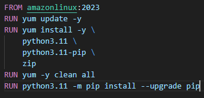

Depois de criar o dockerfile, criei a imagem que será usada no container.

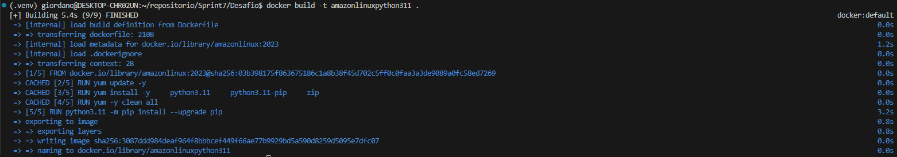

Após criar a imagem, rodei localmente junto com *Bash* para criar os diretórios e baixar a biblioteca para dentro deles.

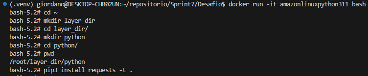

Depois de baixar a biblioteca, compactei ela dentro do container.

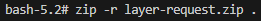

Com a biblioteca compactada, copiei para dentro da pasta do desafio.

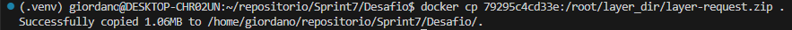

Depois de todos esses passos, por fim, criei a camada com a biblioteca *requests*. Abaixo está a evidência da criação da camada

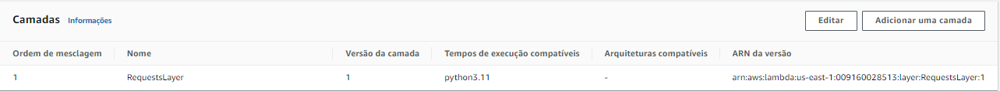

### Criando o Script Lambda

Depois de criar a camada com a biblioteca *requests*, comecei a produzir o script que será rodado no lambda.
-> [Link para o Script Lambda](Request_Lambda.py)

Primeiro passo foi importar alguns módulos e bibliotecas:

O módulo *json* é para poder salvar uma variável com o módulo json e poder salvar o arquivo json no bucket do s3.
O módulo *datetime* é para extrair a data local.
O módulo *os* para pegar a minha chave da API que configurei como variável de ambiente.
A biblioteca *boto3* é para poder lidar com o S3
A biblioteca *requests* para lidar com a API do TMDB

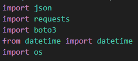

A URL base para buscar os filmes que o Steven Spielberg participou. Posteriormente extrai apenas os filmes que quero.

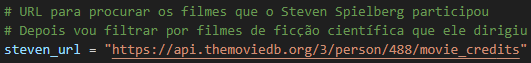

Com o módulo *os* eu salvo o meu token em uma variável local.
Também crio um objeto com a instância da classe *client*.

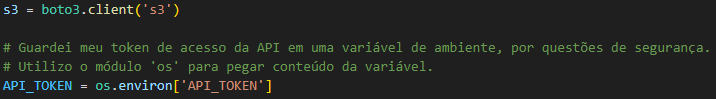

E criei um dicionário com indicando o formato que quero os meus dados e a minha token.

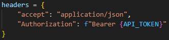

Agora sim eu vou pegar os dados dos filmes do Steven Spielberg. Depois de obter sucesso na comunicação com a API, vou salvar os dados dos filmes que ele participou.
Depois disso, vou filtrar os dados, vou querer apenas os filmes que ele dirigiu, são de ficção científica e foram produzidos antes de 2023
Vou salvar apenas os *ids* dos filmes.
Por fim, criei uma lista vazia, nessa lista vou salvar os dados que quero.

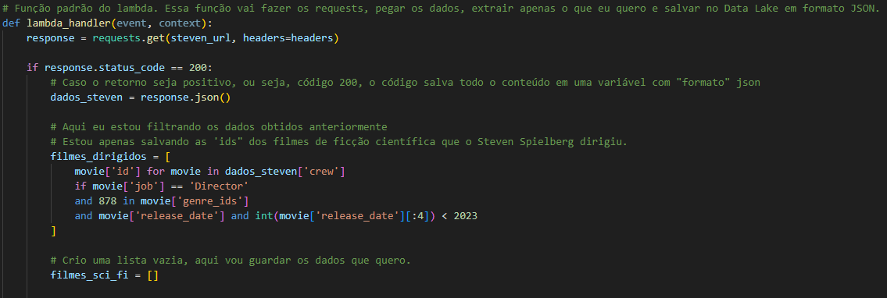

Agora, utilizando os ids dos filmes, quero obter alguns detalhes específicos dos filmes.
Para a minha análise, procurei por dados de popularidade, notas dos usuários e dados financeiros, como receita bruta e orçamento para produção do filme.
Depois de obter esses dados, vou guardando eles na lista criada anteriormente.
Caso dê algum erro, ele me retorna o erro.

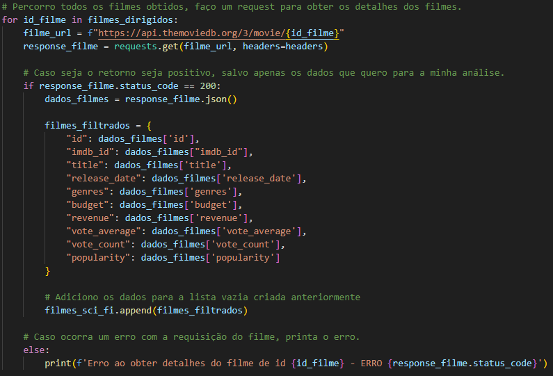

Agora eu crio algumas variáveis que serão utilizadas para criar o caminho de diretórios do meu bucket.
Utilizando o móduto *datetime*, eu extraio o ano, mês e dia atual.
Crio a base do caminho de diretórios *RAW/TMDB/JSON*.
E especifíco qual o bucket que os dados serão persistidos.

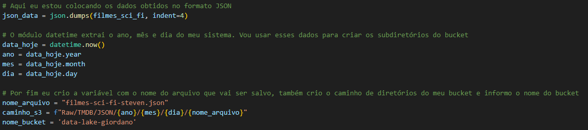

Por fim, com todos os dados filtrados e com as variáveis criadas, carrego esses dados para um arquivo dentro do bucket no S3.
Caso dê algum erro, ele me retorna qual foi o erro.

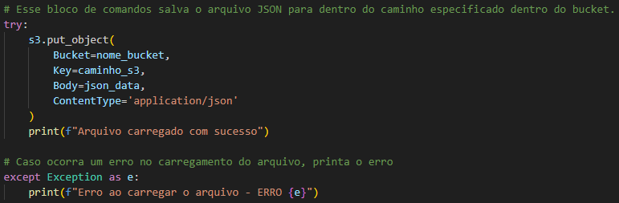

### Configurando o Lambda

Depois de criar o script, rodei ele e percebi dois problemas: o primeiro foi relacionado ao tempo limite da função. Por padrão o tempo limite é 3 segundos, alterei par 1 minuto

Outro problema que tive foi relacionado a permissão do Lambda, tive que fazer uma regra para autorizar o Lambda a gravar arquivos no meu S3

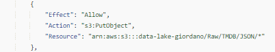

Depois de configurar o tempo limite e as permissões, rodei o script com sucesso.

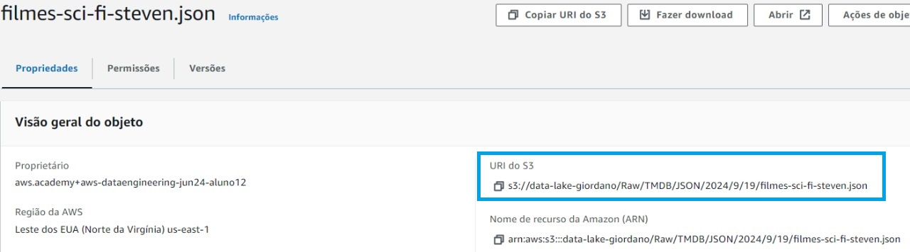
