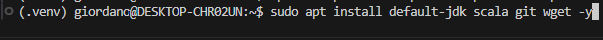
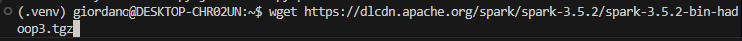

# SPRINT 7

Comecei a Sprint 7 com o curso de Apache Spark e Pyspark.
Os primeiros passos foram instalar o Spark e as suas dependências.

Depois eu instalei a última versão do Apache Spark e o Hadoop.

Com essas dependências instaladas, comecei a praticar junto com o instrutor do curso.

Aprendi sobre RDD e Data Frames dentro do Spark, como eles funcionam. 
Também aprendi funções de consulta com linguagem SQL, lidar com arquivos de entrada e de saída e aprendi a otimizar o meu data frame também

Depois de concluir o curso proposto, fiz os exercícios de Glue e Spark.

- [Exercícios](exercicios/Exercicio.md) <- Passo a passo dos exercícios

Depois de terminar os exercícios, parti para o desafio final

# Desafio

README para o desafio: -> [Desafio](Desafio/README.md)

# Certificados

Sprint sem certificados...