# Exercicio Pyspark

O primeiro exercício proposto foi um contador de palavras utilizando o pyspark.

O primeiro passo é pegar a imagem da internet.

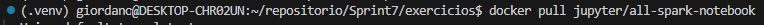

Depois de pegar a imagem da internet, o próximo passo é rodar o container. Utilizei o argumento *-it* para poder interagir com o container e o *-p* para abrir uma porta.


Depois usei o *docker exec* para poder utilizar o *wget* e pegar o readme do meu repositório.

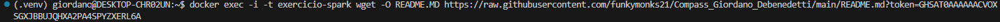

Docker ls para ver os arquivos que estão salvos no container.

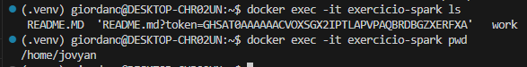

Com o arquivo salvo dentro do container, abri o pyspark e criei um RDD dentro dele com o texto do meu readme.

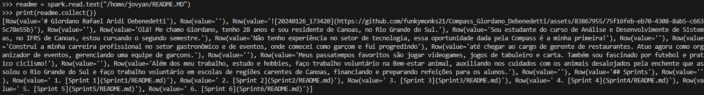

Percebi que não quero o conteúdo antes da "linha" 3 depois da "linha" 16. Usei a função filter para não usar essas linhas e map para pegar apenas o conteúdo das colunas do RDD.

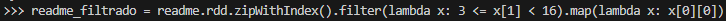

Percebi que tinham palavras que estavam sendo contadas como únicas, por ter alguma pontuação associada. Fiz uma função anônima que exclui essa pontuação, substitiu por espaço e vincula cada palavra a uma coluna.

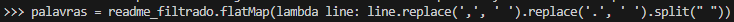

Essa próxima linha soma cada palavra repetida.

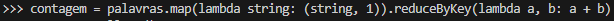

Por fim, o resultado final é este.

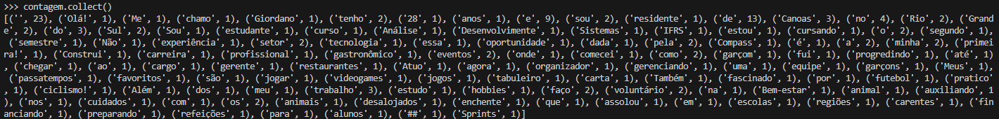

# Exercício Glue

A primeira parte do lab de glue nos pedia para carregar um arquivo para algum bucket que já existisse na nossa conta da AWS.

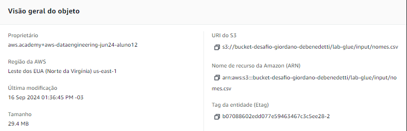


Depois de carregar o arquivo, deveriamos selecionar o nosso usuário no IAM e alterar algumas permissões.
Eu consegui fazer o desafio sem ter que lidar com a parte de usuário, visto que não existia o meu usuário, consegui fazer tudo apenas com a criação do novo IAM Role que foi ensinado nos slides
Depois de criar o Role e dar as permissões necessárias, eu parti para a criação do Job Glue e do seu script.

O Script ficou assim

```python
import sys
from awsglue.transforms import *
from awsglue.utils import getResolvedOptions
from pyspark.context import SparkContext
from awsglue.context import GlueContext
from awsglue.job import Job
from pyspark.sql.functions import *
from awsglue.dynamicframe import DynamicFrame

## @params: [JOB_NAME]
args = getResolvedOptions(sys.argv, ['JOB_NAME', 'S3_INPUT_PATH', 'S3_TARGET_PATH'])

sc = SparkContext()
glueContext = GlueContext(sc)
spark = glueContext.spark_session
job = Job(glueContext)
job.init(args['JOB_NAME'], args)

source_file = args['S3_INPUT_PATH'] 
target_path = args['S3_TARGET_PATH']

# Cria o Data Frame dinâmico
df_dynamic = glueContext.create_dynamic_frame.from_options(
    "s3",
    {
        "paths": [source_file]
    },
    "csv",
    {"withHeader": True, "separator":","},
    )
# Passa para Data Frame do spark
df = df_dynamic.toDF()

# Informa o Schema
df.printSchema()

# Transforma os nomes para caixa alta
df_maiuscula = df.withColumn("nome", upper(df["nome"]))
print(df_maiuscula.count())

# Conta os nomes que mais aparecem no Data Frame
df_agrupado = df_maiuscula.groupBy("ano", "sexo").agg(count("nome"))

# Ordena por ano
df_ordenado = df_agrupado.orderBy(df_agrupado["ano"].desc())
df_ordenado.show(5)

# Mostra os nomes femininos mais usados e em qual ano foi registrado
df_fem = df_maiuscula.filter(df_maiuscula["sexo"] == "F")
df_fem_ordenado = df_fem.orderBy(df_fem["total"].desc())
df_fem_ordenado.show(1)

# Mostra os nomes masculinos mais usados e em qual ano foi registrado
df_masc = df_maiuscula.filter(df_maiuscula["sexo"] == "M")
df_masc_ordenado = df_masc.orderBy(df_masc["total"].desc())
df_masc_ordenado.show(1)

# Conta o números de registros por ano e ordena, de forma crescente, por ano
df_total_por_ano = df_maiuscula.groupBy("ano").agg(sum("total").alias("total_registros"))
df_total_por_ano.orderBy("ano").show(10)

# Tranforma novamente o data frame, agora para DynamicFrame
df_dynamic2 = DynamicFrame.fromDF(df_maiuscula, glueContext, "dynamic_frame_nomes")

glueContext.write_dynamic_frame.from_options(
    frame = df_dynamic2,
    connection_type = "s3",
    connection_options = {
        "path": target_path,
        "partitionKeys": ["sexo", "ano"]
    },
    format = "json")

job.commit()
```

Por fim, o resultado do carregamento dos arquivos para o s3 ficou assim:

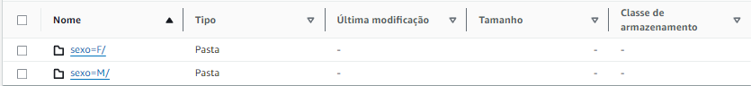

A última parte pedia para usar o crawler e criar uma nova tabela de dados.

Depois de seguir os passos mostrados nos slides, o resultado foi esse:

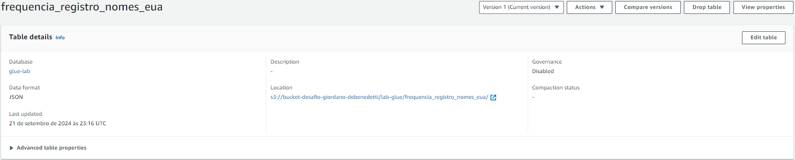