# Desafio Sprint 8

O desafio da Sprint 8 pede para fazer a limpeza dos dados oriundos do CSV e da API do TMDB, devemos fazer isso programando um job no AWS Glue, na linguagem Spark. Depois de fazer essa limpeza, devemos salvar os arquivos no formato *parquet* e um caminho de diretórios com base *trusted*.

## Etapa 1 - Arquivo CSV

A primeira etapa é referente ao arquivo csv oriundo do IMDB.

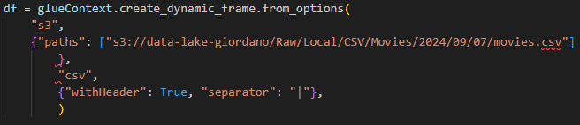

Depois de carregar o arquivo para um dataframe dinâmico, eu passo para um dataframe spark, para fazer algumas alterações.
Também vou trocar os valores "\N" por *null*

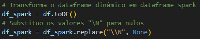

O próximo passo é fazer algumas limpezas.

Aqui eu vou querer apenas os filmes que tenham "Sci-Fi" na coluna *genero*.
Também vou excluir algumas colunas que não serão utilizadas na minha análise.
Nas colunas que utilizarei para a minha análise, excluirei as linhas daquelas que tiverem valores nulos.
Por fim, quero apenas um registro de cada filme, então exluo as linhas duplicadas, pelo id.

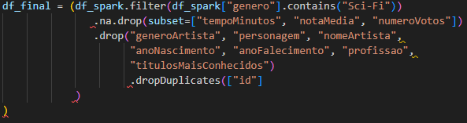

Em um dos testes que eu fiz, percebi que o dataframe foi salvo em 4 partições, quero que salve em apenas uma.
Para resolver isso, utilizei o *coalesce*.

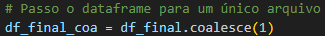

Os últimos passos então são converter o dataframe spark para dataframe dinâmico e salvar o mesmo no S3.

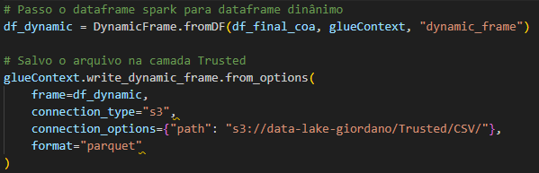

O resultado foi esse arquivo.

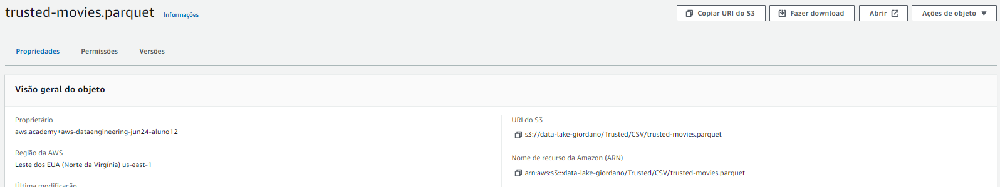

Fiz a verificação do mesmo em um leitor de parquet que encontrei na internet.

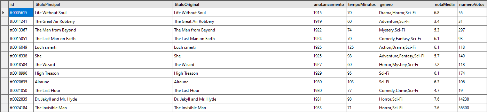

## Etapa 2 - JSON

A segunda etapa foi formatar e converter os dados oriundos da API do TMDB para *parquet*

O primeiro passo foi carregar o arquivo para um dataframe dinâmico

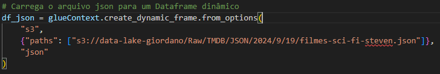

O segundo passo foi transformar o dataframe dinâmico em dataframe spark.

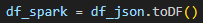

Depois de converter para dataframe spark, fiz uma limpeza e formatação nas colunas.
Decidi excluir a coluna *genres*, *release_date* e *id*.
Renomiei a coluna *id_imdb* para *id* e a coluna *title* para *tituloPrincipal*
Também exclui todas as linhas que continham dados nulos.

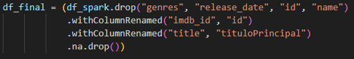

Por final, transformei esse dataframe para dinâmico e salvei no S3.

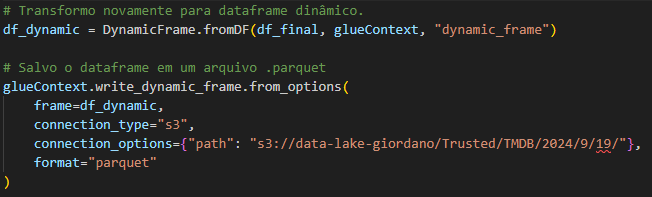

O resultado foi esse.

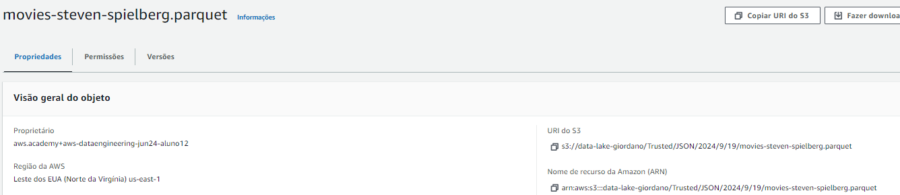

Fiz a leitura do parquet no ParquetViewer.

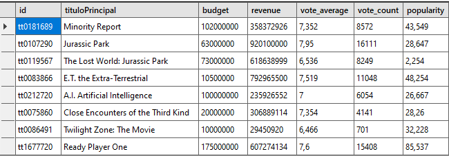

## Considerações

Os dois scripts foram feitos seguindo as instruções do desafio. Com timeout de 60 minutos, 2 workers e utilizando o worker G1X.

O parquet oriundo dos arquivos CSV tem 6170 registros, o print mostra apenas alguns deles.

Os arquivos *.parquet* foram renomeados manualmente.