# Exercicio Sprint 8

Os exercícios dessa sprint foram divididos em 3 partes. A primera sendo um aquecimento, a segunda é relacionada a crianção de um data frame com o pyspark e a terceira é relacionado a API do TMDB.

## Aquecimento

### Aquecimento 1, lista com números aleatórios

O primeiro exercício da sprint 8 pede que criemos uma lista com 250 números inteiros, depois de criar a lista, o exercício pede para invertermos a ordem da lista.

Para o exercício, eu importei o módulo *random*, criei a lista utilizando a função *random.sample(range(1000), 250)*. Essa função vai criar 250 números aleatórios e únicos entre 0 e 999.
Depois eu utilizo o método *reverse* para inverter a ordem da lista.

O script está aqui -> [Random Number](random-num.py)

### Aquecimento 2, lista com animais aleatórios

O segundo exercício pede para criarmos uma lista com 20 nomes de animais, todos distintos. Depois de criar a lista, devemos ordena-los de forma crescente, ou seja, de A até Z.
Depois de ordenar, devemos imprimir na tela a lista, com um animal por linha. Depois de imprimir, devemos passar para um arquivo *.csv* a lista, também com um animal por linha.

Para o script, importei o módulo *csv* nativo do python e depois criei a lista.
Usando a função *.sort*, ordenei a lista por ordem alfabética crescente.
Por último, utilizando um *for*, printei cada animal da lista em uma linha e adicionei o mesmo animal em uma linha de um arquivo *.csv*

O script está aqui -> [Animais](animais.py)

### Aquecimento 3, lista com 10 milhões de nomes diferentes

O último exercício de aquecimento pedia para criassemos um arquivo *.txt* com 10 milhões de nomes aleatórios, para isso, o exercício instrui a fazer isso a partir da bilbioteca *names*.
O primeiro passo então foi instalar a biblioteca na minha máquina:

```console
pip install names
```

Depois de instalar a biblioteca, comecei a criar o script para criar os nomes.

Primeiro importe a biblioteca *names* e o módulo *random*

Depois segui as instruções do exercício, definindo a quantidade de nomes aleatórios e nomes únicos

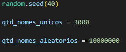

Depois criei uma lista vazia e preenchi com nomes único e aleatórios

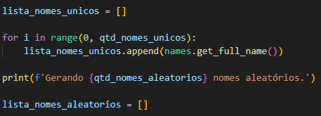

Depois disso, criei outra lista e preenchi com os 10 milhões de nomes aleatórios que foram pedidos.
Depois de preencher essa lista, passei os nomes para um arquivo *txt*, com um nome por linha.

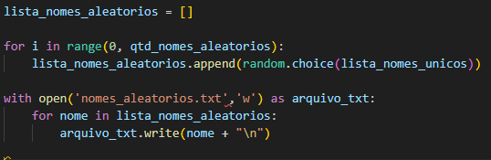

## Data frame Pyspark

### Etapa 1

A primeira etapa do exercício é importar algumas funções que serão utilizadas para o script.

Depois de importar as funções, iniciei a sessão e defini o caminho do arquivo de nomes que será lido e importado para um data frame.

Concluído essa última parte, imprimi as 5 primeiras linhas do data frame.

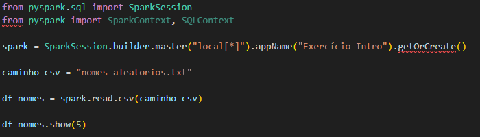

O resultado foi esse:

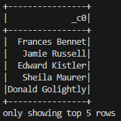

### Etapa 2

A segunda etapa pede para que veriquemos o schema do dataframe. Depois de verificar, precisamos justar o nome da coluna para *"Nomes"* e depois printar o schema e as 10 primeiras linhas do dataframe.

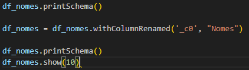

O resultado da impressão foi esse:

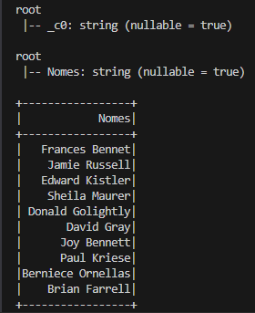

### Etapa 3

A etapa 3 pedia para adicionar uma coluna chamada *Escolaridade* ao dataframe, essa coluna deveria ter strings aleatórias entre: "Fundamental", "Medio" e "Superior".
O exercício também pedia para usar funções nativas do spark e evitar usar iterações. Para resolver esse problema, importei *functions* do pyspark.sql, vou usar a função *.rand* para ajudar a distribuir os valores de forma aleatória.

Eu decidi usar uma *seed* fixa, para não ter diferença nas diferentes etapas do desafio.

O bloco de código ficou assim, eu imprimi o resultado no final para verificar como tinha ficado a distribuição e se tinha ficado no formato correto:

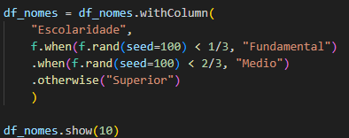

O resultado foi esse:

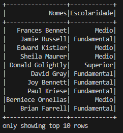

### Etapa 4

Essa etapa pede para adicionar uma coluna chamada *Pais* no dataframe e distribuir aleatoriamente países da américa do sul.

Fiz algo parecido com a etapa passada, a diferença é que criei uma lista anteriormente com os nomes do países.

Usei a mesma *seed* que utilizei na etapa passada.

Imprimi as 10 primeiras linhas do dataframe para ver se a formatação tinha ficado correta

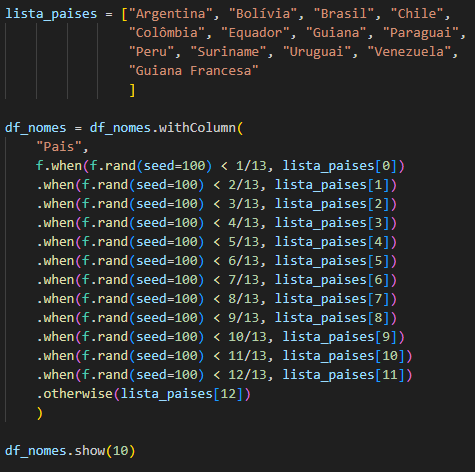

O resultado da impressão foi essa:

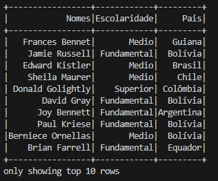

### Etapa 5

A etapa 5 pede para adicionar uma coluna chamada *AnoNascimento* e distriuir uniformemente e aleatoriamente anos entre 1945 e 2010.

Para isso, utilizei o *.rand*, mas multipliquei o resultado do número aleatório por **2010 - 1945** e somei **1945** no resultado. Depois usei cast para transformar o tipo em inteiro.

Fiz uma verificação no schema, para ver se o Spark havia passado o tipo correto para o dataframe, também imprimi as 10 primeiras linhas no console, para ver se estava corretamente formatado.

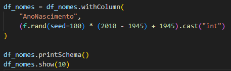

O resultado foi esse:

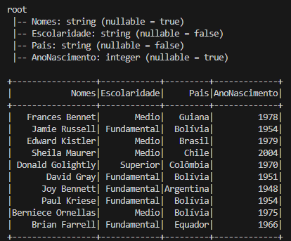

Assim confirmei que o schema do dataframe estava correto.

### Etapa 6

A etapa 6 pede para criar outro dataframe apenas com as pessoas que nasceram nesse século.

Utilizei o método *select* e *filter* para filtrar pelas linhas em que o ano de nascimento fosse maior que 2000.

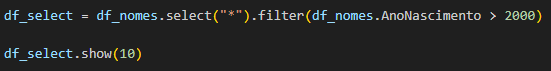

O resultado foi esse:

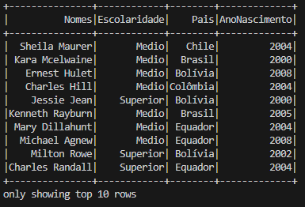

### Etapa 7

A etapa 7 pede para fazer a mesma coisa da etapa passada, porém usando *sql*

O código ficou assim:

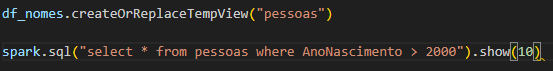

O resultado foi esse: 

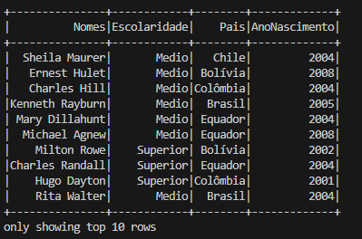

### Etapa 8

A etapa 8 pede para contar a quantidade de "millenials" do dataframe.

Para isso, utilizei *select*, *filter* e *count*

O bloco de código ficou assim:

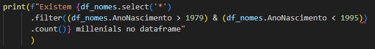

O resultado foi esse:

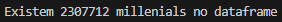

### Etapa 9

A etapa 9 pede a mesma tarefa da etapa passada, porém utilizando o sql.

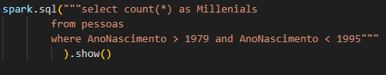

Esse foi o resultado:

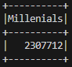

### Etapa 10

A etapa 10 pede para um novo dataframe com o Pais, a Geração e a quantidade de pessoas daquela geração, isso em um consulta usando SQL.

Devemos então separar o dataframe pelas gerações e contar quantas pessoas tem de cada geração em cada país.

O bloco de código ficou assim:

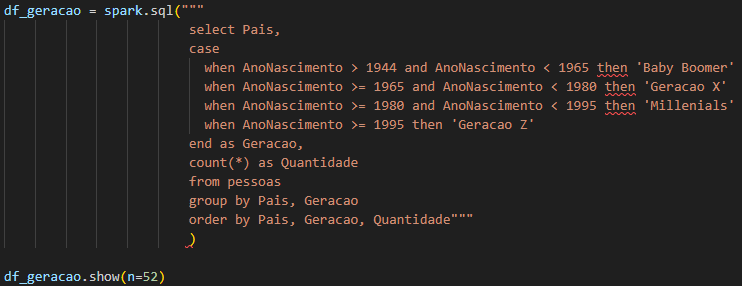

O resultado foi esse:

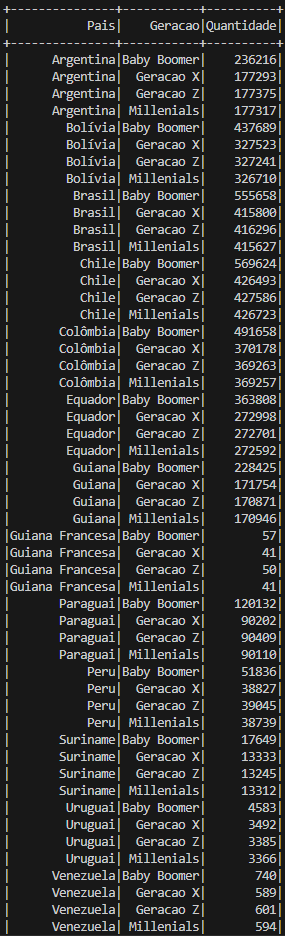

# Exercicio TMDB

Conforme conversado com o SM, o exercício de TMDB não precisou ser feito, pois já criamos a conta dele na sprint passada.
