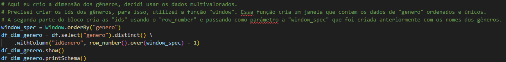

# Desafio Sprint 9

O desafio da Sprint 9 pede para fazermos a modelagem dimensional dos dados que foram refinados na sprint passada.

A realidade é que eu não achei a minha sprint passada boa, então eu refiz os passos anteriores. A principal mudança que fiz, foi relacionado a forma que os dados foram salvos na camada *Trusted*.
Eu havia feito dois scrips separados, um para o *json* e outro para o *csv* e salvei em dois caminhos diferentes do diretorio *Trusted*, mas optei agora por unir as duas fontes de dados em uma só.

Depois de ter resolvido esse problema, fui resolver outro problema que tive na sprint passada: o crawler.
O crawler não conseguia criar o data lake, os dados pareciam não ter sido devidamente passados para o data lake e as tabelas não continham nenhum dado, mesmo que os arquivos *parquet* continham os dados corretos.

Ai sim, depois de resolver esses problemas da sprint passada, fui a resolução do desafio da Sprint 9.

## Modelagem multidimensional

O primeiro passo para o desafio da sprint 9 é fazer a modelagem dos dados da camada Trusted para o modelo multidimensional.
O Modelo Multidimensional proprõe a criação de uma tabela "principal" com o fato a ser analizado, que no meu caso são os filmes de ficção científica dirigidos pelo Steven Spielberg.
Depois da construção da tabela fato, tabelas auxiliares, ou dimensões, são criadas para auxiliar na análise dos dados.
A tabela fato deve conter apenas dados quantitativos, enquanto as dimensões podem conter dados descritivos, que auxiliem na análise posterior.

Levando em consideração essas "regras" do modelo multidimensional, o meu modelo ficou assim:

Eu criei a tabela principal "FatoFilme" com os dados como id do filme, dados sobre avaliações do público do IMDB e do TMDB, popularidade no site do TMDB e alguns dados financeiros, como o orçamento do filme e a receita bruta do filme. Além disso, existe uma coluna para o ano de publicação do filme e o tempo do filme em minutos. Por último, a coluna "idGenero" referencia a dimensão dos gêneros de cada filme.

As dimensões criadas foram: **Dimensão** para os gêneros, como a tabela Fato deve conter apenas dados quantitativos, ou seja, números, não faria sentido eu deixar os gêneros nela, por isso, criei uma dimensão para os gêneros; **Dimensão** para o nome do filme, usando a mesma regra da dimensão anterior, o nome do filme fica em outra tabela; **Dimensão** para tempo, uma dimensão para tempo pode ajudar a análise, por isso, criei uma dimensão para o tempo, se baseando no ano de publicação do filme, criei atributos que podem me auxiliar na análise, como década e século da publicação do filme.

## Script para a Modelagem

Abaixo está o script que foi utilizado no AWS Glue para criar as tabelas do modelo multidimensional.

[Script para a Modelagem](script_modelagem.py)

### Importanto módulos

Comecei importando alguns módulos que serão utilizados pelo script

Vou usar o *floor* e *col* para criar as colunas de década e século da minha tabela *DimTempo*.
*Window* eu utilizei para criar os ids da tabela *DimGenero*, utilizei também o *row_number*.
O módulo *datetime* eu utilizo para extrair a data local e criar o caminho dos diretórios do bucket.
E eu carrego o módulo de tipos inteiros para modificar o tipo das colunas de décadas e séculos, que são criadas como *bigint*.

### Carregando os dados do S3

Depois de carregar os módulos que serão usados no script, eu carreguei o arquivo com os dados tratados na sprint passada para um dynamic frame e depois converti para um dataframe spark.
Fiz alguns testes para verificar se os dados foram devidamente carregados, sem perdas.

Esse foi o resultado do upload:

### Criando a dimensão de tempo

Comecei então a criar as dimensões, primeiro criei a dimensão de tempo.

Para criar as colunas de década e século eu fiz uma função que trunca a divisão do ano específico por 10 ou 100, para década e século. Para a década então eu multiplico por 10 e para o século eu somo 1.
Os dados estavam saindo como *bigint*, passei para *int*.

O resultado dos testes foram esses:

### Criando a dimensão com o nome dos filmes

Para a criação da dimensão com os nomes dos filmes, apenas selecionei os atributos e *id* e *titulo* do dataframe principal para o dataframe com a dimensão

O resultado foi esse:

### Criando a dimensão dos gêneros

A última dimensão a ser criada, foi a dimensão com os gêneros.
Para criar ela, precisei criar ids para refencia-las na tabela Fato. Precisei criar uma *janela* com os dados da coluna *generos*, aproveitei para ordena-las também.
Depois de ordenar, criei as *ids* utilizando o *row_number* e *over*.

O resultado foi esse:

### Criando a tabela Fato

Por fim, criei o dataframe que será a base da a tabela Fato Filmes.
Para criar a tabela, fiz um join entre o dataframe principal e o dataframe da dimensão de gêneros.

O resultado foi esse:

### Extraindo a data local

Para poder persistir os dataframes no s3 com a data da modelagem, preciso extrair a data local e para isso, utilizei o módulo datetime.
Extrai a data local, o ano, mês e dia do processamento.
Depois eu crio uma variável que servirá de base para os caminhos distintos da camada *Refined*

### Passando para Dynamic Frame e salvando no S3

Como quero salvar os dados apenas em um arquivo, utilizo o Coalesce para processar os dados em apenas um arquivo.
Depois eu converto para os dataframes para dynamic frame e salvo no s3.

### Arquivos Salvos e seus diretórios

Importante mencionar que eu renomeei os arquivos manualmente.

DimTempo:

DimNomeFilme:

DimGenero:

FatoFilme:

## Criando o data lake e verificando os dados com o Athena

Como na sprint passada eu tive problemas com o crawler, eu decidi criar as tabelas com o Athena mesmo.

### Dimensão Tempo Athena

O resultado foi esse:

### Dimensão Nome Athena

O resultado foi esse:

### Dimensão Gênero

O resultado foi esse:

### Fato Filme

O resultado foi esse:

